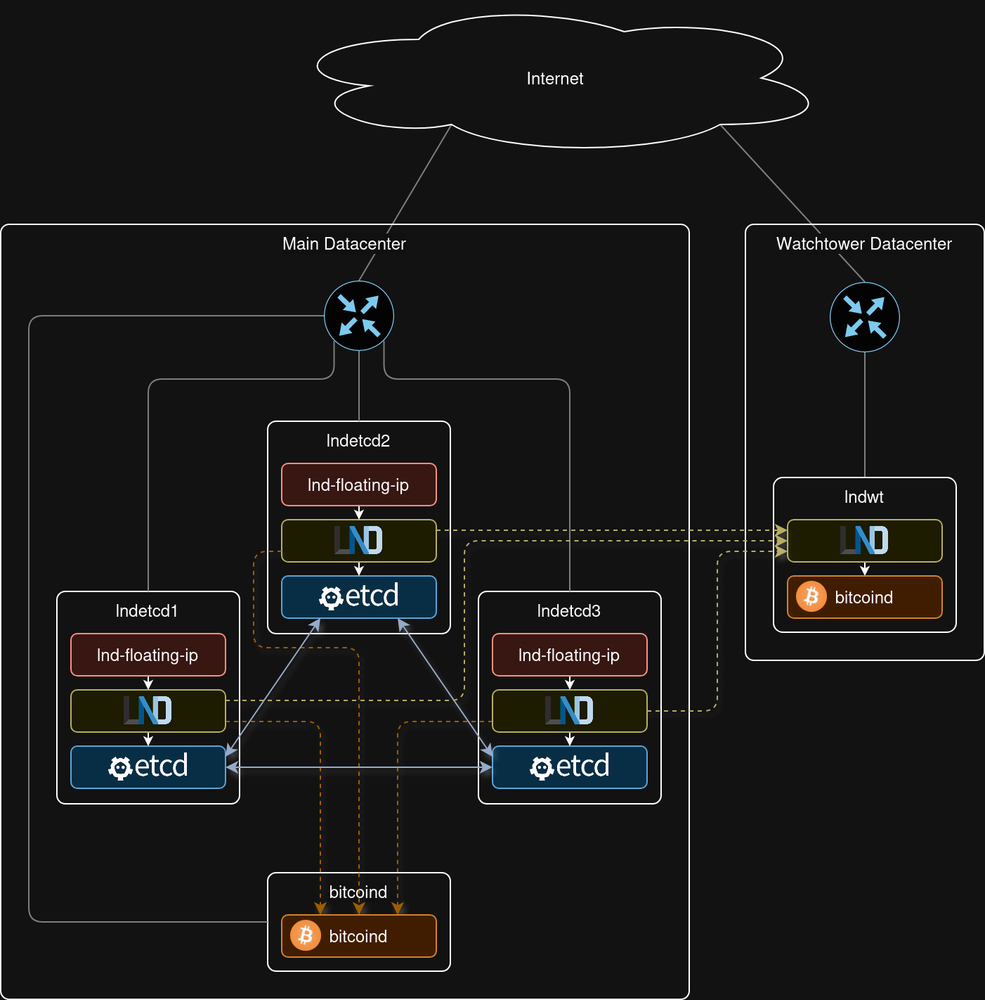
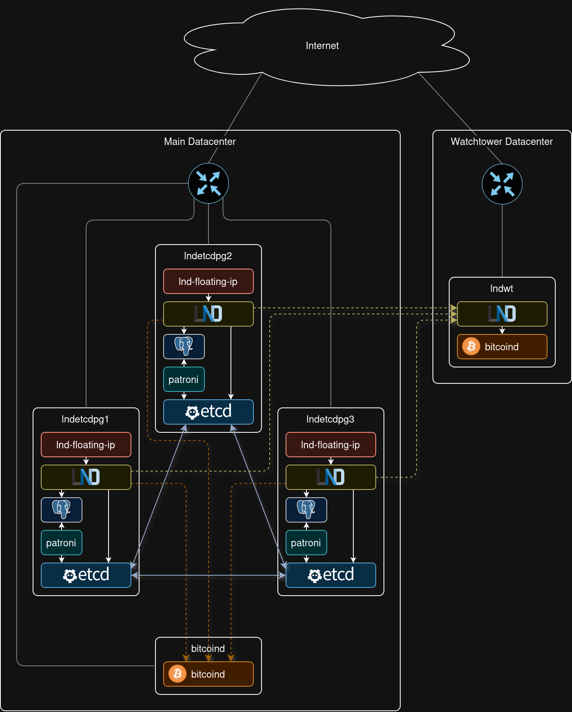
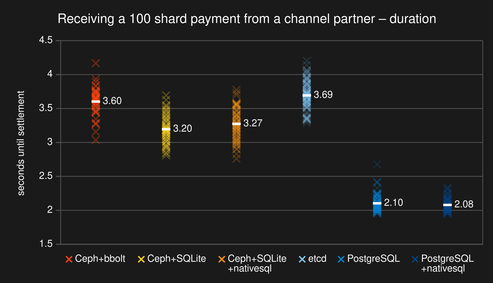
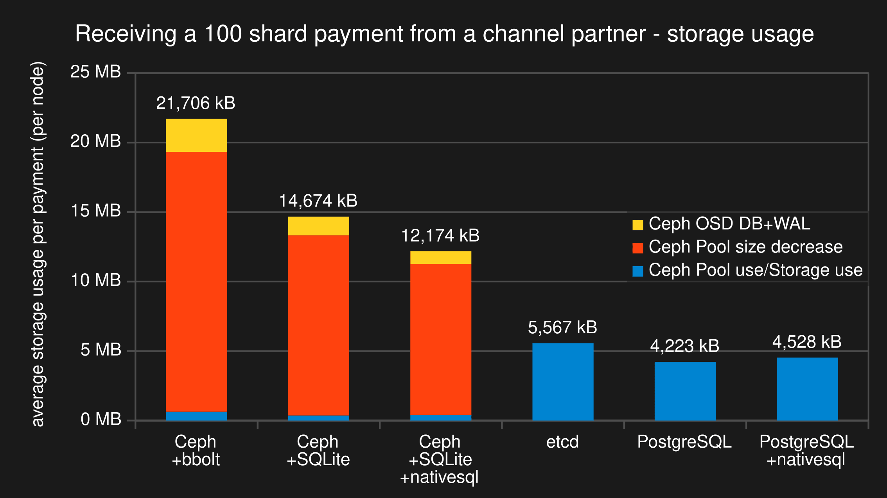
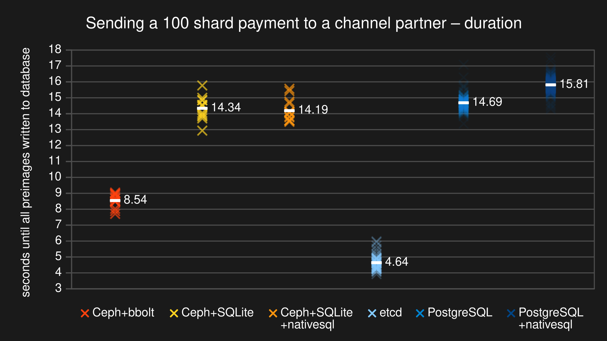
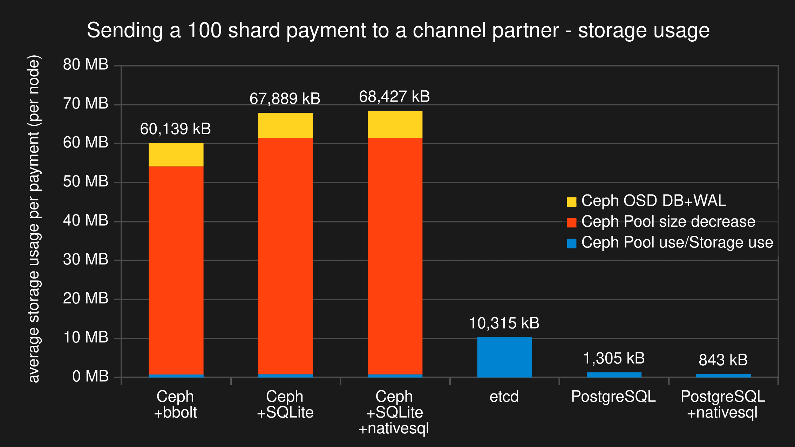

# Highly available LND cluster setup

This repository provides some examples of setting up an LND Lightning node in a 3-node cluster to achieve high availability. This setup allows the Lightning node to remain operational even if one of the three nodes fails, ensuring minimal downtime. Furthermore, the replicated database safeguards against data loss.

## Leader election

In a highly available cluster of multiple nodes, there must always be a single active leader running the core LND logic. The other nodes must be on standby, waiting to take over in the event that the leader fails. Ideally, this should work without human intervention. Thankfully, this can be automated using the leader election provided by [etcd](https://etcd.io/).

### What is etcd?

> etcd is a strongly consistent, distributed key-value store that provides a reliable way to store data that needs to be accessed by a distributed system or cluster of machines. It gracefully handles leader elections during network partitions and can tolerate machine failure, even in the leader node.

Fortunately, LND supports leader election via etcd, enabling the operation of a cluster where there is only ever one leader able to read and modify LND's replicated state database.

For more information on etcd leader election in LND, see the LND documentation: https://docs.lightning.engineering/lightning-network-tools/lnd/leader_election

## Solution 1: LND cluster with etcd backend

Since etcd is also a distributed key-value store, it can serve as a database for LND to store its state in. Anything written to the database on one node is automatically replicated to all the other nodes in the cluster. The write operation is not considered successful until it has been replicated to the majority of the nodes in the cluster. The majority agreeing on a database state forms a quorum. The quorum is necessary to determine which state of the database is the correct, most recent one. For this reason, in a 3-node cluster, at least 2 of the nodes must be available to achieve a quorum.

### Floating IP address

To achieve location transparency and ensure that the leader instance instance of LND is consistently accessible via the same IP address, irrespective of the node it is currently operating on, a floating IP address can be utilized. A floating IP address is a form of virtual IP address that can be dynamically reassigned between different instances. Multiple servers can share the same floating IP address, but it can only be active on one server at a time.

### Lightning Watchtower

Optionally, a Lightning Watchtower can be set up in a remote datacenter to protect funds in the unlikely event that the entire cluster fails or loses internet connectivity. The Watchtower would monitor the Bitcoin blockchain for channel breaches (revoked commitment transactions) and, if detected, broadcast a penalty transaction to prevent the loss of funds.



## Solution 2: LND cluster with PostgreSQL backend

Another way is to use [PostgreSQL](https://www.postgresql.org/) as the replicated database backend for LND. PostgreSQL is a battle-tested relational database system developed since the 1980s. It is widely trusted in production environments for its reliability, robustness and performance.

This setup still uses etcd for leader election, since that is the only leader elector supported by LND. etcd also serves as a distributed configuration store for [Patroni](https://github.com/patroni/patroni), a tool that manages replication and failover of the PostgreSQL cluster.

An important consideration with this setup is that the LND leader must always run on the same instance as the PostgreSQL primary, since PostgreSQL replicas are read-only. However, this is automatically handled by LND, which will fail to start if it connects to a read-only database.



## etcd vs. PostgreSQL as a database backend for LND

As evidenced in the preceding section, configuring PostgreSQL as the replicated database backend is more complex than using etcd. But how does this choice impact performance?

LND v0.18.3-beta does not yet realize the full potential of SQL-based database backends. Since LND was originally built on a key-value pair database, the SQL backend currently stores most data, except for invoices, as serialized key-value pairs. However, as development progresses, it is expected that more parts of the database will transition to native SQL schemas, thereby improving performance. To use the existing native SQL schemas, enable them by passing the `db.use-native-sql` flag to LND.

### Benchmarks

To compare the different setups, a series of benchmarks were conducted. The three instances forming the LND cluster were run as separate virtual machines on the same physical host. The storage backend were virtual SATA disks located in RAM and rate limited to 400 MB/s, 92k read IOPS and 83k write IOPS to simulate the performance of a typical consumer-grade SATA SSD. Each instance was given 1 CPU core with 2 threads (pinned and isolated) and 3 GiB of RAM.

A Lightning channel was established between the LND cluster and a single LND node with a bbolt database. This single LND node was run directly on the host, utilizing the 3 remaining CPU cores (each with 2 threads), with its bbolt database stored on a ramfs. This setup was designed to ensure the node operated very quickly, minimizing any impact it could have on the benchmark results.

In addition to the already described setups, LND was also tested on a Ceph pool. [Ceph](https://ceph.io/en/) is a distributed storage solution. In the benchmarks, the LND database was stored on a Ceph Block Device distributed across three BlueStore OSDs running on 3 different virtual machines. Each OSD was backed by three virtual SATA disks, designated for `block`, `block.db`, and `block.wal` respectively.

In total, six different setups were evaluated:

- LND v0.18.3-beta with a bbolt database backend running on a Ceph RBD
- LND v0.18.3-beta with an SQLite database backend (without the `db.use-native-sql` flag) on a Ceph RBD
- LND v0.18.3-beta with an SQLite database backend (with the `db.use-native-sql` flag) on a Ceph RBD
- LND v0.18.3-beta cluster with an etcd database backend and etcd leader election
- LND v0.18.3-beta cluster with a PostgreSQL+Patroni database backend (without the `db.use-native-sql` flag) and etcd leader election
- LND v0.18.3-beta cluster with a PostgreSQL+Patroni database backend (with the `db.use-native-sql` flag) and etcd leader election

### Benchmark: Receiving a 100-shard multi-part payment

The first and most important benchmark focuses on receiving payments. In this test, an invoice is paid from the single LND node as a multi-part payment, split into 100 HTLCs along a predefined route. The benchmark measures the time from the initiation of the payment until the settlement of all HTLCs. Notably, the process of writing the preimages to the database on the single LND node is excluded from the measurements, since it is not relevant to the performance of the clustered node. The test was repeated several times to obtain an average result.



The benchmark results indicate that setups using a PostgreSQL database backend provide the fastest performance for receiving payments.



Regarding storage consumption, setups using Ceph consumed significantly more than the other setups. Receiving payments on Ceph-based setups caused the metadata of the Ceph OSDs to grow rapidly, quickly filling up the disks. This is likely due to unnecessary replication of uncompacted bbolt/SQLite database file contents.

### Benchmark: Sending a 100-shard multi-part payment

The second benchmark involves paying an invoice of the single LND node from the clustered node as a multi-part payment split into 100 HTLCs along a predefined route. The time measured spans from the initiation of the payment until the successful writing of all preimages into the database of the clustered node. This process was repeated several times to obtain an average result.



The benchmark results indicate that sending payments is currently fastest with an etcd database backend. The slow performance of SQL-based databases like SQLite and PostgreSQL is expected to improve in the future as more parts of the database migrate from serialized key-value pairs to native SQL schemas.



The storage consumption of the Ceph based setups is also very high when sending payments. What is really remarkable though, is the very low storage usage of the PostgreSQL based setups.

### Benchmark conclusion

The benchmarks clearly indicate that a database on top of a Ceph RBD is not suited for operating an LND node due to its high storage consumption.

Currently, etcd serves a reasonable middle ground. While it doesn't excel in any specific area, it performs adequately across the board.

PostgreSQL has the lowest storage footprint of all the tested options. Its performance for receiving payments is unmatched, but sending payments is quite slow. However, this is likely to improve in the future as more parts of the LND database migrate to native SQL schemas. With this outlook in mind, using a PostgreSQL database in an LND cluster appears to be a sensible choice.

Additionally, PostgreSQL benefits from optimizations enabled by its architecture, where it is writable only on the primary node and read-only on replicas. In contrast, etcd can be written to from any node, facilitating faster failover times since the LND leader does not need to be on the same instance as the etcd leader.

| etcd                    | PostgreSQL         | Ceph |
|-------------------------|--------------------|------|
| medium storage consumption | ✅ low storage consumption | ❌ high storage consumption |
| ✅ easier setup | manageable setup | ❌ complicated setup |
| key-value pair database | ✅ relational database with outlook for performance improvements | ❌ replication of everything (also irrelevant parts of the database file) |
| ✅ fast failover | slower failover | (failover times not evaluated) |

## Building

For any of the setups Bitcoin Core binaries have to be obtained. Run the following commands to build Bitcoin Core, or refer to [bitcoin/doc/build-unix.md](https://github.com/bitcoin/bitcoin/blob/master/doc/build-unix.md) for more detailed build instructions.

```console
git clone --branch v25.0 https://github.com/bitcoin/bitcoin.git
cd bitcoin
./autogen.sh
./configure
make
```

Build at least lnd v0.18.3-beta, or make sure that the following patch is applied: https://github.com/lightningnetwork/lnd/pull/8938 Also make sure that lnd is compiled with the "kvdb_etcd" and "watchtowerrpc" build tags. If a PostgreSQL setup is planned, add the "kvdb_postgres" build tag as well.

```console
git clone --branch v0.18.3-beta https://github.com/lightningnetwork/lnd.git
cd lnd
make install tags="kvdb_etcd kvdb_postgres watchtowerrpc"
```

Move the resulting binaries (`bitcoind`, `bitcoin-cli`, `lnd`, `lncli`) to the `bin` directory.

## Deploying

Either go the manual route and set everything up according to this [manual](setup_lnd_cluster_guide.md), or automate most of the process with a deploy script by following the steps below.

To get started, set up a Debian instance called "bitcoind" to act as a Bitcoin full node. Configure the firewall to allow incoming connections on the following ports:

- 22 (SSH)
- 8332 (Bitcoin RPC)
- 8333/18333/38333/18444 (Bitcoin Mainnet/Testnet/Signet/Regtest)
- 29000 (ZeroMQ block hash publisher)
- 29001 (ZeroMQ transaction publisher)
- 29002 (ZeroMQ block publisher)

Next there are two options. Either setup the LND cluster with an etcd database backend or setup the LND cluster with a PostgreSQL database backend.

<details>
<summary>Option 1: etcd database backend</summary>

Set up 3 Debian instances with ECC memory called "lndetcd1", "lndetcd2" and "lndetcd3". These will act as a 3-node LND+etcd cluster. Configure the firewall to allow incoming connections on the following ports:

- 22 (SSH)
- 2379 (etcd client communication)
- 2380 (etcd peer communication)
- 9735 (Lightning)

All instances need to have public key authentication configured for root SSH access in order for the deploy script to work.

Next start an ssh-agent on a local system and add the SSH private keys for the 4 Debian instances. This allows for ssh to connect to the instances without having to manually specify the respective private key file each time.

```console
eval "$(ssh-agent -s)"
ssh-add <bitcoind_ssh_key> <lndetcd1_ssh_key> <lndetcd2_ssh_key> <lndetcd3_ssh_key>
```

Then run the deploy script with the following arguments:

- bitcoind_ip - IP address of the bitcoind instance
- lndetcd1_ip - IP address of the lndetcd1 instance
- lndetcd2_ip - IP address of the lndetcd2 instance
- lndetcd3_ip - IP address of the lndetcd3 instance
- floating_ip - floating IP address that will always point to the current leader LND node
- <mainnet|testnet|signet|regtest> - Chain/Network that should be used
- bitcoindrpcuser - RPC username to use for bitcoind
- bitcoindrpcpass - RPC password to use for bitcoind
- lndwalletpass - Password used to encrypt the LND wallet

```console
./deploy_with_etcddb.sh <bitcoind_ip> <lndetcd1_ip> <lndetcd2_ip> <lndetcd3_ip> <floating_ip> <mainnet|testnet|signet|regtest> <bitcoindrpcuser> <bitcoindrpcpass> <lndwalletpass>
```
</details>

---

<details>
<summary>Option 2: PostgreSQL database backend</summary>

Set up 3 Debian instances with ECC memory called "lndetcdpg1", "lndetcdpg2" and "lndetcdpg3". These will act as a 3-node LND+etcd+PostgreSQL cluster. Configure the firewall to allow incoming connections on the following ports:

- 22 (SSH)
- 2379 (etcd client communication)
- 2380 (etcd peer communication)
- 5432 (PostgreSQL)
- 8008 (Patroni REST API)
- 9735 (Lightning)

All instances need to have public key authentication configured for root SSH access in order for the deploy script to work.

Next start an ssh-agent on a local system and add the SSH private keys for the 4 Debian instances. This allows for ssh to connect to the instances without having to manually specify the respective private key file each time.

```console
eval "$(ssh-agent -s)"
ssh-add <bitcoind_ssh_key> <lndetcdpg1_ssh_key> <lndetcdpg2_ssh_key> <lndetcdpg3_ssh_key>
```

Then run the deploy script with the following arguments:

- bitcoind_ip - IP address of the bitcoind instance
- lndetcdpg1_ip - IP address of the lndetcdpg1 instance
- lndetcdpg2_ip - IP address of the lndetcdpg2 instance
- lndetcdpg3_ip - IP address of the lndetcdpg3 instance
- floating_ip - floating IP address that will always point to the current leader LND node
- <mainnet|testnet|signet|regtest> - Chain/Network that should be used
- bitcoindrpcuser - RPC username to use for bitcoind
- bitcoindrpcpass - RPC password to use for bitcoind
- lndwalletpass - Password used to encrypt the LND wallet

```console
./deploy_with_postgresdb.sh <bitcoind_ip> <lndetcdpg1_ip> <lndetcdpg2_ip> <lndetcdpg3_ip> <floating_ip> <mainnet|testnet|signet|regtest> <bitcoindrpcuser> <bitcoindrpcpass> <lndwalletpass>
```
</details>

## Optional: Deploying the watchtower

The optional next step is to setup a watchtower in a different datacenter.

Start by setting up a Debian instance called "lndwt" with public key authentication configured for root SSH access and incoming connections on the following ports allowed in the firewall:

- 22 (SSH)
- 8333/18333/38333/18444 (Bitcoin Mainnet/Testnet/Signet/Regtest)
- 9911 (LND watchtower)

Add the SSH key to the ssh-agent if necessary.

```console
ssh-add <lndwt_ssh_key>
```

Then run the deploy script with the following arguments:

- lndwt_ip - IP address of the lndwt instance
- floating_ip - IP address pointing to the current leader lnd node
- <mainnet|testnet|signet|regtest> - Chain/Network that should be used
- [bitcoind_ip] - IP address of the bitcoind instance (Only needs to be specified when network is regtest)

```console
./deploy_watchtower.sh <lndwt_ip> <floating_ip> <mainnet|testnet|signet|regtest> [bitcoind_ip]
```
