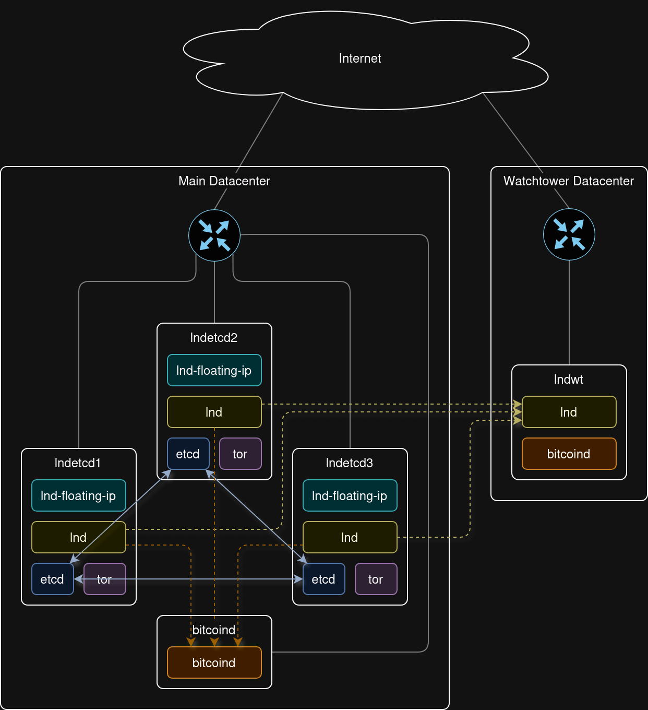

# Highly available LND cluster setup

This repository provides an example of how to set up a highly available LND lightning node by running it as a 3-node cluster. The state is stored in a replicated etcd database. The active leader node is always accessible via the same floating IP address and a Tor hidden service.

## Topology



## Building

Build Bitcoin Core

```console
git clone --branch v25.0 https://github.com/bitcoin/bitcoin.git
cd bitcoin
./autogen.sh
./configure
make
```

Build at least lnd v0.18.3-beta, or make sure that the following patch is applied: https://github.com/lightningnetwork/lnd/pull/8938 Also make sure that lnd is compiled with the "kvdb_etcd" and "watchtowerrpc" build tags.

```console
git clone --branch v0.18.3-beta https://github.com/lightningnetwork/lnd.git
cd lnd
make install tags="kvdb_etcd watchtowerrpc"
```

Move the resulting binaries (`bitcoind`, `bitcoin-cli`, `lnd`, `lncli`) to the `bin` directory.

## Deploying

Either go the manual route and set everything up according to this [manual](setup_lnd_etcd_guide.md), or automate the process by using the `deploy.sh` script.

To get started, set up a Debian instance called "bitcoind" to act as a Bitcoin full node. Configure the firewall to allow incoming connections on the following ports:

- 22 (SSH)
- 8332 (Bitcoin RPC)
- 8333/18333/38333/18444 (Bitcoin Mainnet/Testnet/Signet/Regtest)
- 29000 (ZeroMQ block hash publisher)
- 29001 (ZeroMQ transaction publisher)
- 29002 (ZeroMQ block publisher)

Furthermore set up 3 Debian instances with ECC memory called "lndetcd1", "lndetcd2" and "lndetcd3". These will act as a 3-node LND+etcd cluster. Configure the firewall to allow incoming connections on the following ports:

- 22 (SSH)
- 2379 (etcd client communication)
- 2380 (etcd peer communication)
- 9735 (Lightning)

All instances need to have public key authentication configured for root ssh access in order for the deploy script to work.

Next start an ssh-agent on a local system and add the ssh private keys for the 4 Debian instances. This allows for ssh to connect to the instances without having to manually specify the respective private key file each time.

```console
eval "$(ssh-agent -s)"
ssh-add <bitcoind_ssh_key> <lndetcd1_ssh_key> <lndetcd2_ssh_key> <lndetcd3_ssh_key>
```

Then run the deploy script with the following arguments:

- bitcoind_ip - IP address of the bitcoind instance
- lndetcd1_ip - IP address of the lndetcd1 instance
- lndetcd2_ip - IP address of the lndetcd2 instance
- lndetcd3_ip - IP address of the lndetcd3 instance
- floating_ip - floating IP address that will always point to the current leader lnd node
- <mainnet|testnet|signet|regtest> - Chain/Network that should be used
- bitcoindrpcuser - RPC username to use for bitcoind
- bitcoindrpcpass - RPC password to use for bitcoind
- lndwalletpass - Password used to encrypt the LND wallet

```console
./deploy.sh <bitcoind_ip> <lndetcd1_ip> <lndetcd2_ip> <lndetcd3_ip> <floating_ip> <mainnet|testnet|signet|regtest> <bitcoindrpcuser> <bitcoindrpcpass> <lndwalletpass>
```

The optional next step is to setup a watchtower in a different datacenter.

Start by setting up a Debian instance called "lndwt" with public key authentication configured for root ssh access and incoming connections on the following ports allowed in the firewall:

- 22 (SSH)
- 8333/18333/38333/18444 (Bitcoin Mainnet/Testnet/Signet/Regtest)
- 9911 (LND watchtower)

Add the ssh key to the ssh-agent if necessary.

```console
ssh-add <lndwt_ssh_key>
```

Then run the deploy script with the following arguments:

- lndwt_ip - IP address of the lndwt instance
- floating_ip - IP address pointing to the current leader lnd node
- <mainnet|testnet|signet|regtest> - Chain/Network that should be used
- [bitcoind_ip] - IP address of the bitcoind instance (Only needs to be specified when network is regtest)

```console
./deploy_watchtower.sh <lndwt_ip> <floating_ip> <mainnet|testnet|signet|regtest> [bitcoind_ip]
```
